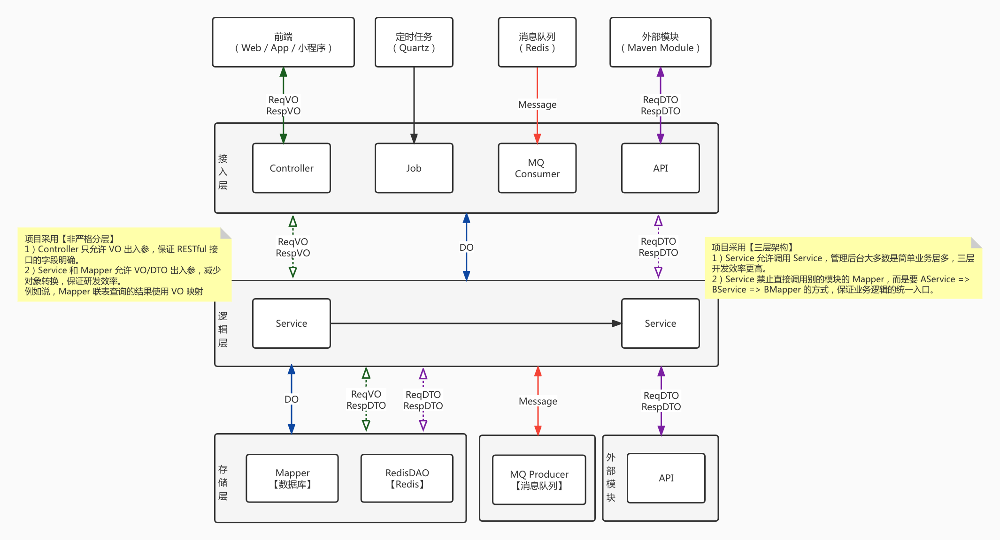

东胜生产业务管控系统

**概述：以springboot+mybatis-plus+redission等为主的单体架构**

**系统环境**

|框架|说明|版本|
|---|---|---|
|JDK|Java 开发工具包| JDK8|
|Maven|Java 管理与构建工具|`>=` 3.x.x|
|Nginx|高性能 Web 服务器|-|

**主框架**

| 框架        | 说明         | 版本   |
| ----------- | ------------ | ------ |
| Spring Boot | 应用开发框架 | 2.7.17 |
| Spring MVC  | MVC 框架     | 6.1.1  |
| Spring            |     spring core         |        |

**存储层**

|框架|说明|版本|
|---|---|---|
|MySQL|数据库服务器|`>=` 5.7|
|Druid|JDBC 连接池、监控组件|1.2.20|
|MyBatis Plus|MyBatis 增强工具包|3.5.4.1|

**中间件**

| 框架                | 说明                    | 版本      |
| ------------------- | ----------------------- | --------  |
| Flowable            | 工作流引擎              | 7.0.0       |
| Quartz              | 任务调度组件            | 2.3.2       |
| Resilience4j        | 服务保障组件            | 2.1.0         |
| EasyExcel           | Excel拓展               | 3.3.2        |
| apache-tika         | 文件分析                | 2.7.0       |
| Quartz              | 定时任务                | 2.7.17        |
| skywalking          | 监控相关                | 8.12.0       |
| RabbitMQ            | 消息中间件              | 2.4.17       |
| AMQP                | spring rabbitMQ support | 2.4.17        |
| Redis               | key-value 数据库        | `>=` 5.0      |
| Redisson            | Redis 客户端            | 3.25.0      |
| Spring Security     | Spring 安全框架         | 6.2.0        |
| Hibernate Validator | 参数校验组件            | 8.0.1         |
| jimureport          | 积木报表                |   1.6.1          |

**单元测试**

| 框架    | 说明              | 版本   |
| ------- | ----------------- | ------ |
| JUnit   | Java 单元测试框架 | 5.10.1 |
| Mockito | Java Mock 框架    | 5.7.0  |

**其它工具**

| 框架      | 说明                 | 版本        |
| --------- | -------------------- | ----------- |
| Springdoc | Swagger 文档         | 2.2.0       |
| Jackson   | JSON 工具库          | 2.15.3      |
| MapStruct | Java Bean 转换       | 1.5.5.Final |
| Lombok    | 消除冗长的 Java 代码 | 1.18.30     |
| guava          |           常用java工具           |    32.1.3         |
